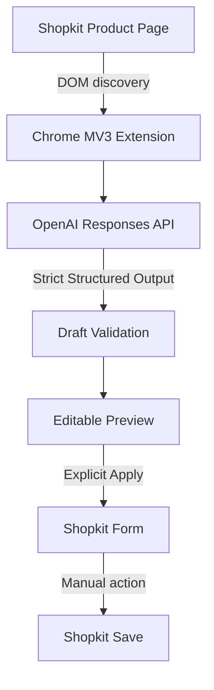

# ShopKit Product Builder

Chrome extension that turns a product title into a structured, editable ecommerce draft, then safely applies reviewed product, category, and SEO data to a Shopkit product form.

Built with JavaScript, Chrome Manifest V3, OpenAI Responses API, GPT-5.6 Luna, and strict Structured Outputs. Human review remains required before Apply.

## Demo / Screenshot

A sanitized product-workflow demo will be added here.

## Problem

Shopkit product creation requires repetitive entry across title and content, description, excerpt, category, brand, tags, weight, SEO metadata, and media lookup. This extension reduces drafting work while preserving review for critical product decisions.

## Solution

Content script discovers relevant Shopkit form options, requests one structured draft, validates it against available options, and presents editable fields before any native form write.

## Workflow

```text
Product Title
     |
Generate
     |
OpenAI Structured Output
     |
Validation
     |
Editable Preview
     |
Review / Edit / Lock
     |
Explicit Apply
     |
Shopkit Form
     |
Manual Shopkit Save
```

Generate does **not** write to native Shopkit form. Apply is explicit. Final Shopkit save remains manual.

## Engineering Highlights

- Manifest V3 content script with narrow host permission.
- Shadow DOM assistant UI, responsive panel, closed initial state, Escape close.
- OpenAI Responses API with `gpt-5.6-luna` default, `reasoning.effort: none`, and `store: false`.
- Strict JSON Schema Structured Outputs.
- DOM option discovery and validation for categories and brands.
- TinyMCE description writes and Chosen.js select synchronization.
- Product identity protection, stale-draft invalidation, and field locks across regeneration.
- Sanitized generated HTML and classified API errors.
- Focused Node regression tests for workflow and safety invariants.

## Architecture



`extension/content.js` owns page integration, draft lifecycle, validation, and explicit Apply. `extension/options.js` stores user configuration locally. No backend exists.

## Safety by Design

- Price is never automatically overwritten.
- Generate never automatically applies data.
- Apply requires explicit user action.
- Extension never automatically triggers "Gravar dados".
- Generated HTML is sanitized before description writes.
- API keys are never bundled in repository.
- Luna path disables OpenAI request storage with `store: false`.
- Host matching stays intentionally narrow.
- Generation errors are sanitized before logging.
- `chrome.storage.local` stores local extension data; it is not encrypted secrets storage.

See [SECURITY.md](SECURITY.md) for API-key and data-handling guidance.

## Technical Challenges

- Integrating with dynamic Shopkit DOM without official application API access.
- Synchronizing native selects with Chosen.js and rich text with TinyMCE.
- Validating generated category and brand names against options present on page.
- Keeping regeneration, edited drafts, field locks, and product identity separate.
- Rejecting unsafe description HTML and reporting expected API failures safely.

## Testing

Regression checks cover `500ml`, `6x500ml`, multi-component weights, bundle detection, excerpt length, price preservation, Generate/Apply separation, no automatic submission, stale-draft invalidation, product identity, locks, category handling, closed/open Shadow DOM panel state, Escape close, inline Generate recovery, API configuration readiness, safe `400`/`401`/`429`/timeout/network errors, GPT-5.6 Luna default, Responses API, `reasoning: none`, `store: false`, Structured Outputs, sanitized placeholder hostname, and narrow-layout behavior.

```bash
node --check extension/content.js
node --check extension/options.js
node tests/regression.test.js
```

Checks do not provide full browser end-to-end coverage. Shopkit integration still requires manual browser validation.

## Tech Stack

- JavaScript and CSS
- Chrome Extension Manifest V3
- Chrome Storage API
- OpenAI Responses API
- GPT-5.6 Luna
- JSON Schema Structured Outputs
- Shadow DOM, TinyMCE, Chosen.js, Shopkit DOM
- Node `assert` regression tests

## Installation

1. Clone repository.
2. Replace exact placeholder hostname in `extension/manifest.json` and `extension/content.js` runtime guard.
3. Open `chrome://extensions/`, enable Developer Mode, then load unpacked `extension/`.
4. Open Options and enter OpenAI API key.

## Configuration

| Setting | Description | Default |
|---|---|---|
| `apiKey` | User-supplied OpenAI API key | Required |
| `model` | OpenAI model name | `gpt-5.6-luna` |

Public code targets `https://example-store.shopk.it`. Replace exact hostname in `extension/manifest.json` and `extension/content.js` runtime guard. Keep HTTPS and exact matching; do not use `<all_urls>` or `*://*/*`.

## Limitations

- Shopkit DOM selectors may change.
- One configured hostname at a time.
- API key lives browser-side in local extension storage.
- Generated content requires human review.
- No automatic product publishing, backend, or batch system.
- Media selection uses existing Shopkit media workflow.
- Not official Shopkit product.

## Project Status

Feature-complete portfolio version.

Current version is intentionally frozen around core Generate -> Preview -> Review -> Apply workflow. Future experiments, including improved media discovery, are deferred rather than expanding current scope.

## Author

Rafael Lopes
GitHub: [@Woddy23](https://github.com/Woddy23)
Portfolio: https://rafadesigns.vercel.app/developer

This repository is published for portfolio and educational review. No open-source licence is currently granted.
